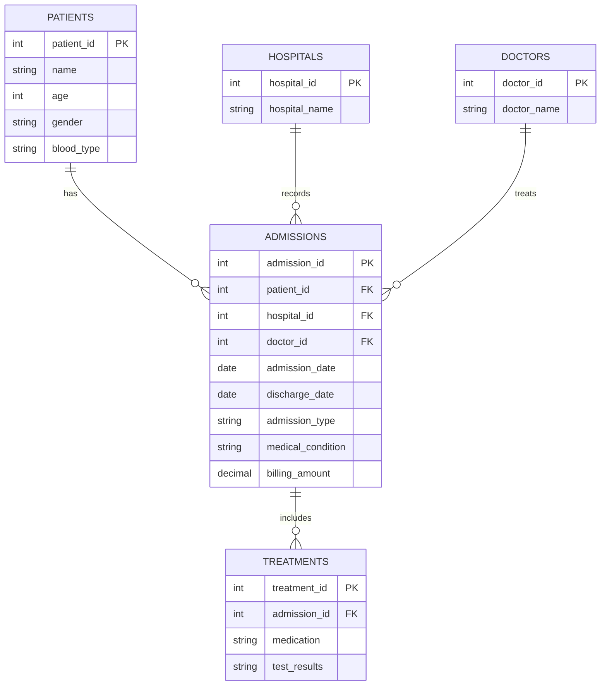
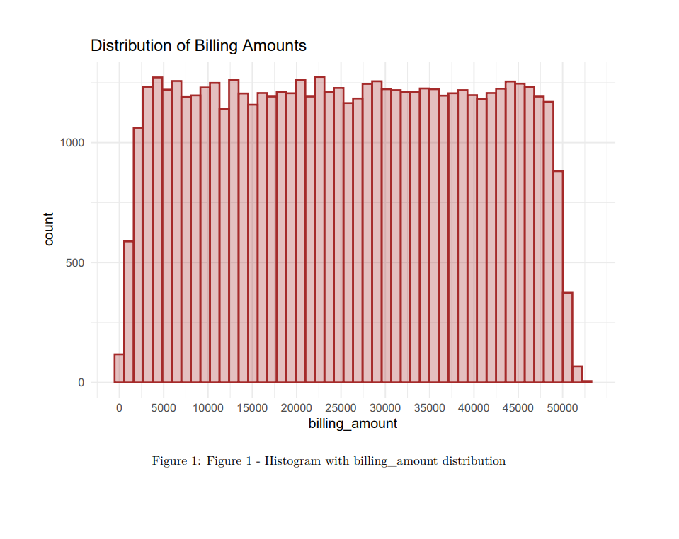
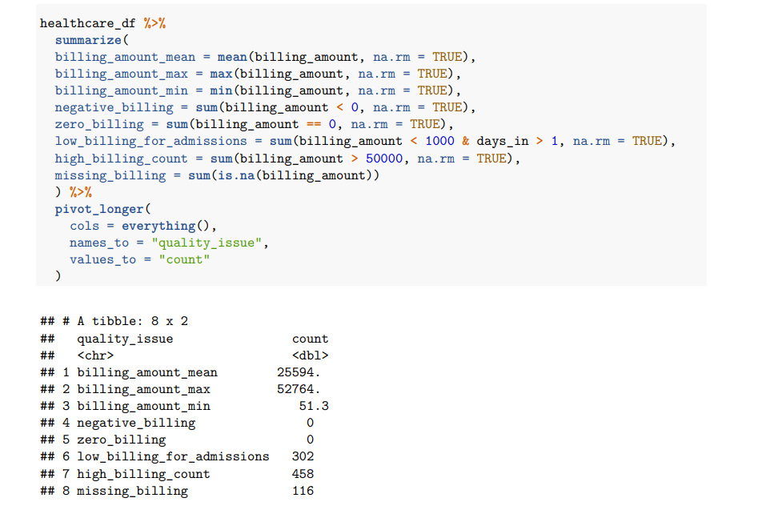
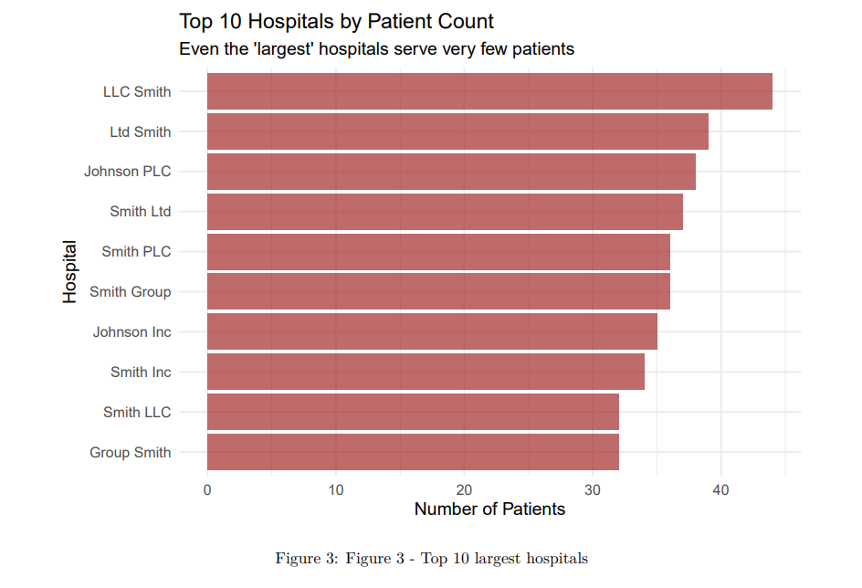
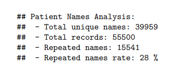
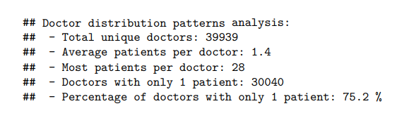
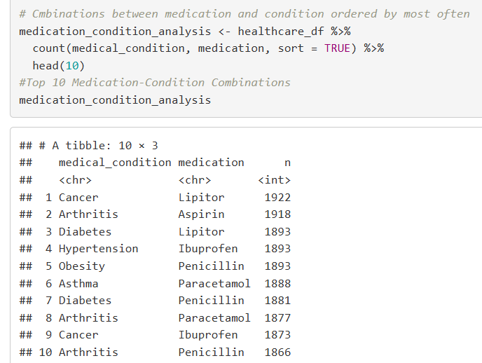

# Healthcare-Data-Quality-Assessment-Project
This project utilizes a healthcare dataset from Kaggle to develop and demonstrate practical data analysis skills. While working with artificial data, this exercise provides valuable experience in identifying data quality issues, performing exploratory analysis, and understanding healthcare data structures that mirror real-world scenarios.

# Table of Contents

1.Background and Overview

2.Data Structure Overview

3.Executive Summary

4.Insights Deep Dive

5.Recommendations

6.Caveats and Assumptions

# Background and Overview

## Introduction to the Company

To contextualize this analysis, we will consider a fictional entity: SynthCare Health, a mid-sized hospital network seeking to optimize its operations and improve care quality through data analysis. SynthCare Health recently initiated a project to consolidate data from its various hospitals but faces significant challenges related to data consistency and reliability.

## Objective of the Analysis

The primary objective of this analysis is to conduct an in-depth assessment of SynthCare Health's patient dataset to identify quality issues, uncover anomalous patterns, and provide a foundation for improving data collection and management processes. The project serves as a proof of concept to demonstrate how data analysis can reveal operational and clinical inefficiencies.

## How the Analysis Helps the Company

This analysis is crucial for SynthCare Health as it exposes critical vulnerabilities in its data systems. By addressing the issues raised, the company can achieve more robust data that will lead to more accurate billing, better allocation of clinical resources, and more informed strategic decision-making. 

## Methodology and Tools

This analysis employed a hybrid data preparation approach that combined the accessibility of spreadsheet
software with the reproducibility of programming tools.

### Initial data cleaning in Excel:
• Removal of clearly erroneous negative billing values
• Basic formatting standardization
• Documentation of initial data quality issues
### Data processing in R:
• Data type conversion and validation
• Advanced cleaning procedures
• Systematic quality assessment
• Exploratory data analysis and visualization
This combined approach leveraged Excel’s accessibility for initial inspection and R’s reproducibility for
systematic data processing.

## Areas of Focus

The insights and recommendations from this analysis focus on four main areas:

1. Billing Patterns and Accuracy: Investigating the distribution of hospitalization costs and identifying anomalies that suggest issues in billing systems.

2. Patient and Provider Data Integrity: Assessing the consistency and uniqueness of patient, doctor, and hospital records.

3. Clinical Pathway Consistency: Analyzing the relationship between medical conditions and prescribed medications to detect misalignments.

4. Overall Dataset Quality: Quantifying the impact of missing data, formatting errors, and synthetic artifacts on the reliability of the analysis.

# Data Structure Overview

### Logical Entity-Relationship Diagram - ERD

Although this analysis was performed on a single csv file, a key finding was the severe data quality issues (e.g., duplicate hospital names, illogical clinical combinations). These issues are often prevented by a well-designed relational database.

This logical ERD illustrates how the data should be structured in a database to ensure data integrity and prevent the anomalies found. It shows the main entities—Patients, Admissions, Hospitals, Doctors, and Treatments—and how they are linked. This model serves as a blueprint for a more robust data system.

The original dataset lacked unique identifiers (Primary Keys - PKs) for entities like Patients, Hospitals, and Doctors which are important for uniqueness. This absence is the direct cause of the data fragmentation observed in the analysis (e.g., 39,639 unique hospital names). A well-structured database, as shown below, uses Foreign Keys (FKs) to link tables, ensuring that each hospital name is stored only once, thereby preventing the duplication and inconsistency issues found.

A patient may have zero or multiple admissions, but each admission must be associated with exactly one patient.
A hospital may record multiple admissions, but each admission occurs at a single hospital.
A doctor may treat multiple admissions, while each admission is assigned to one doctor.
An admission may include zero or multiple treatments, but each treatment belongs to exactly one admission.

This model highlights how each table should ideally relate to one another, explaining why duplication and fragmentation were observed in the original dataset due to the absence of primary keys.

# Executive Summary

This analysis revealed that the SynthCare Health dataset suffers from systemic data quality issues, characteristic of synthetically generated data. The distribution of billing amounts is unrealistically uniform, rather than following the expected right-skewed distribution in real-world healthcare data, which features a high volume of low costs and a long tail of high costs. Severe naming inconsistencies were identified for patients and hospitals, with an implausible fragmentation of hospital names and a patient name repetition rate of 28%. Furthermore, the analysis detected illogical misalignments between medical conditions and prescribed medications, such as the use of Lipitor for Cancer. These anomalies indicate that the data, in its current state, is unreliable for clinical or financial decision-making. Recommendations focus on implementing automated data validations and standardizing naming conventions.

# Insights Deep Dive

## Billing Anomalies
The analysis of 55,500 admission records showed that billing amounts are distributed almost uniformly between $1,000 and $50,000.  

458 cases were found with billing amounts artificially clustered near the upper limit of $52,764, and 302 cases had suspiciously low values (<$1,000) for multi-day hospital stays.

In the past, SynthCare Health may have relied on manual or outdated billing systems, leading to inconsistent cost data capture. The data uniformity may be an artifact of a test system or a synthetic data generation process that fails to adequately simulate real-world variation, where a small percentage of complex cases (Pareto principle) typically drive the majority of costs.

## Entity Fragmentation
The dataset contains 39,639 unique hospital names serving only 55500 patients and the top 10 largest hospitals all maintain similar patient volumes (32-44 patients).

28% of the patients names repeat which exceeds typical real-world healthcare database rates (8-16%)

39,959 unique doctor names for only 55,500 admissions in which 75% of doctors are associated with only one patient. 

All of this is implausible compared to real healthcare systems. Each hospital may have used its own naming conventions (e.g., "Smith LLC," "Smith Group," "Ltd Smith"), and data consolidation was done without a cleaning and standardization process, resulting in this unrealistic amount of duplicated entities.

## Clinical Misalignment
The analysis of condition-medication combinations revealed illogical patterns with nearly identical counts (around 1,900 each), such as Lipitor (cholesterol) for Cancer and Penicillin (antibiotic) for Obesity.

This issue affects quality of care and patient safety. Incorrect medication prescription is a serious risk, and the inability to trust the data for clinical analysis prevents the optimization of treatment protocols.
This pattern is a strong indicator of synthetic data generation, where variables were randomly combined instead of following clinical logic. In a real-world scenario, this could indicate severe failures in clinical decision.

# Recommendations

1. Implement automated validation rules for medication-condition clinical alignment - In real healthcare settings, it could be useful to implement a clinical decision support system that automatically checks if a prescribed medication is clinically appropriate for the patient’s condition. By developing a database that maps medications to their appropriate medical conditions, the system could flag a prescription if it doesn’t align with the diagnosed condition (for example, flagging insulin for a fracture). This would serve as a safety net against prescription errors while significantly improving data quality for analytical purposes.
   
3. Establish standardized naming conventions for healthcare facilities -To address inconsistent hospital naming patterns, I would propose creating a national registry of healthcare institutions with standardized official names, where each facility receives a unique ID. Furthermore, an automated namematching software could be implemented to correct variations (e.g., standardizing ‘Hospital St. Mary’, ‘St Mary Hospital’, and ‘St. Mary’s Medical Center’ to one official name). This standardization would enable more accurate performance analysis and reporting by institution.
   
5. Implement systems with pre-configured pricing- Rather than manual entry I recommend automated price selection based on service type and insurance provider. Each insurance company would
have their rate tables and public healthcare services would also have standardized pricing. This approach would eliminate the artificial billing patterns observed in this synthetic dataset, where amounts appear randomly generated rather than reflecting real healthcare pricing structures.

# Caveats and Assumptions

It is essential to acknowledge the limitations and assumptions of this analysis:

Synthetic Nature of the Data: The artificial nature of the dataset caused many artifacts of data generation (uniform billing distribution, clinical misalignment) which do not represent real operational problems. The project is, therefore, an exercise in identifying types of errors, rather than an analysis of a real company.

Assumptions: It was assumed that the goal was to simulate a US healthcare provider environment. Recommendations are based on best practices for such environments, but their applicability would depend on the specific technological and operational context of the organization.

